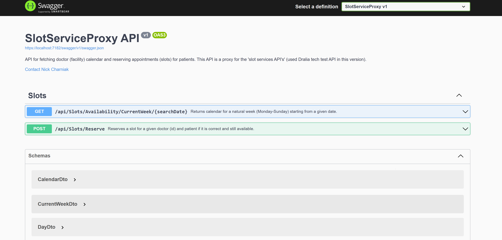

# Slot Service Proxy API

Repository contains the ASP.NET Core 8.0 Web API application, which is provide possibility for fetching doctor (facility) calendar and reserving appointments (slots) for patients. This API is a proxy for the '**_slot services API's_**' (used Dralia tech test API).

## **Content**

- [_Setup and Launch_](#setup-and-launch)
- [_Code structure_](#code-structure)
- [_Design Notes_](#design-notes)

# Setup and Launch

To launch the Web API, you must have installed [.NET 8 SDK](https://dotnet.microsoft.com/en-us/download/dotnet/8.0) on your local environment.**No more external dependencies needed**. I suggest to use Rider IDE for checking and running the application, but it is not required.

In a case if some problems occured with building project, first of all try to restore NuGet packages (**not via IDE, but via command line**):
```bash
dotnet restore
```

Codebase doesn't contain any hardcoded Dralia Test API credentials, so you must provide them by yourself. 
To do this, please navigate to `SlotServiceProxy/appsettings.json` file and put your credentials into the `DraliaCredentials` section:

```json
"DraliaCredentials": {
      "Username": "<put_valid_username>",
      "Password": "<put_valid_password>"
  }
```
After that you can run the application via IDE or via command line:
```bash
dotnet run --project SlotServiceProxy
```
By default, the application's url for https configuration is a `https://localhost:7182` for `HTTPS` and http://localhost:5295 for default 'HTTP' So, if those ports are reserved on your local environment, please change it to another one in `SlotServiceProxy/Properties/launchSettings.json` in
corresponding https section: 

```json
"https":{
"commandName":"Project",
"dotnetRunMessages":true,
"launchBrowser":true,
"launchUrl":"swagger",
"applicationUrl":"https://localhost:7182;http://localhost:5295",
"environmentVariables":{
"ASPNETCORE_ENVIRONMENT":"Development"
}
```
Feel free to use any other configuration, which is provided in `launchSettings.json` file, if you need it.

Role of FrontEnd part is played by Swagger UI, which is available by default on `https://localhost:7182/swagger` url.


Starting from this point, you can use Swagger UI to test the application.

# Code structure

- `SlotServiceProxy` - a web application which determines a communication level via API endpoints.
- `SlotServiceProxy.Application` - contains set of handlers responsible for validation of input data, checking business rules, passing valid data to  
  **Doctor's Timetable Sources** and validate response from them as well. SDK communication (set of DTO models) between API and Application layers
  also located here.
- `SlotServiceProxy.Domain` - contains domain models (abstract data structures which are not depend from concrete timetable sources, but
  encapsulates natural invariants for timetables / slots ), business rules which must be applied to different scenarios and set contract between 
  **Doctor's Timetable Sources** and Application layer via interfaces. Together with `SlotServiceProxy.Application` it is a core of the application.
- `SlotServiceProxy.Infrastructure` - an infrastructure related code: 
  - DI configuration, 
  - implementation of technical services (IDateTimeService as example);
- `SlotServiceProxy.Shared` - contains shared code, which can be used by any other layer, doesn't depend on any other layer and doesn't contain any
  business logic or nuget packages. It is a place for shared constants, enums, extension methods, common models.
- `DraliaSlotService` - contains implementation of **Doctor's Timetable Sources** for Dralia tech test API. It is a separate project communicate with 
  Dralia API via SDK (DraliaSlotService.SDK) and provide data to the application layer wrapped into domain models. So, the application layer 
  doesn't depend on concrete timetable source, but only on domain models and business rules.

# Design Notes

1. I employed the classic [**Onion Architecture**](https://en.wikipedia.org/wiki/Hexagonal_architecture_(software)) to construct an independent domain with *abstract and natural invariants* (data structures and rules). This approach proves beneficial in the following ways:
    - **Streamlined Work Process:** While formulating domain rules and models, my focus was on *real-world rules and invariants*, as well as the *expectations of API users*. This allowed me to seamlessly reuse abstractions when coding for the Dralia API, enabling a concentrated effort on the specifics of API, requests, and responses.
    -  **Enhanced Extensibility and Maintainability:** My API remains completely independent of the Dralia API, avoiding dependencies in terms of model formats, structural rules, or as a sole timetable data source. This design facilitates the effortless addition of new timetable sources while reusing domain logic, thereby allowing a concentrated effort on the specific rules and details of third-party APIs, databases, or any other data source.

2. Using [**MediatR**](https://github.com/jbogard/MediatR) for such a small app
    - **In-built clean structure:** For each specific request, you automatically have a dedicated handler that focuses solely on that particular flow. It cannot inadvertently reuse code from a "similar" handler. DRY (Don't Repeat Yourself) is a good principle, but attempting to reuse code across very different flows and then making changes can lead to unforeseen issues. Given that I actively worked on this project for one week and introduced numerous changes, MediatR has proven to be very helpful. While it's possible to create two separate services, MediatR makes it practically impossible to use a handler for anything other than handling a specific request.
    - **Tiny 3rd-party package:** MediatR is a lightweight package that has minimal impact on the typical flow of web API requests. It doesn't introduce a completely new way of thinking and isn't overly complex. I utilized it in a straightforward manner.

3. [**Declarative style**](https://en.wikipedia.org/wiki/Declarative_programming) (a little and in places) - `To / Do / BiMap`. I tried not to abuse it,
   but I prefer the declarative programming style over 
   the imperative for writing business code. From my POV, it helps to read business rules as more or less natural English sentences in a few lines. **It's a matter of taste, and it's a very subjective one - I understand this fully**, that's why:
   - **I didn't use external libraries**, such as Lang.Ext ([https://github.com/louthy/language-ext](https://github.com/louthy/language-ext)), or anything similar.
   - **I employed only very simple techniques** that correspond to:
       - Forward pipe operator (`|>` in F#`);
       - Very limited currying;
   - I hope it will not introduce any difficulties for you to read the code, but make it even better :)

4. `Result<Data, Error>` for handling unsuccessful (not unexpected or broken!) flows or [Railway Oriented Programming](https://fsharpforfunandprofit.com/rop/)
    - **More stable execution flow:** Exceptions force skipping method calls and finding the first catch in a stack of calls, making understanding of handling unexpected tasks challenging.
    - **Exceptions are designed to describe exceptional situations**, not unsuccessful ones. They must be used in the right places only.
    - **Yes, it results in somewhat ugly signatures** for async methods, like `Task<Result<Data, Error>>`, but it is still preferable, from my point of view, compared to the problems mentioned above :)
